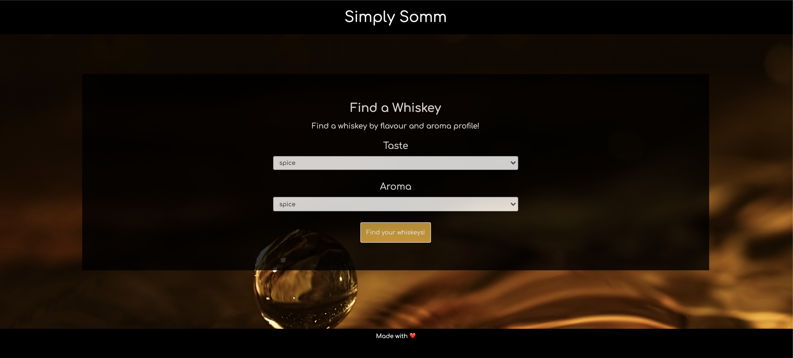
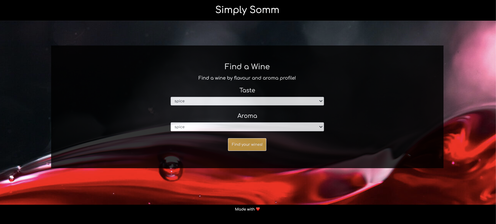
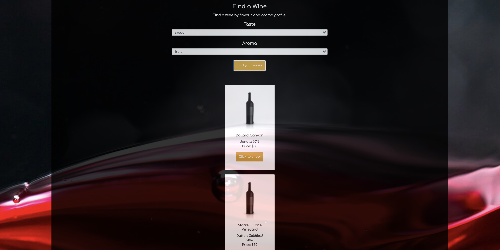

## **Simply-Somm**
------

## **Live Link**

<h2><a href ="https://metric-drake-50737.herokuapp.com/">Live Link</a></h2>

## **Description**

Simply Somm is an app that allows a user to essentially have their very own sommelier at their fingertips. This app gives a user the ability to view and search for wines and whiskeys based on certain taste and aroma criteria. If a user is looking for a wine that is floral on the nose and sweet tasting the app will query a database of wines and then display wines that correlate to those taste and aroma paramters. Then the user will be able to see a selection of wines that fit their taste and aroma wants and needs. If the user is searching for a whiskey they will do the same procedure entering a taste and aroma they would like and then whiskeys that fit those search parameters will be displayed for the user. The app uses a Sequelize database that works with the use of two through tables. The database is populated with a variety of wines and whiskeys that correlate with certain taste and aroma profiles.

## **Installation**
Step 1. In the terminal do a git clone using the repository from this link: https://github.com/KingKitty89/project2

Step 2. Install all the required dependences using the command below:

    npm install

Step 3: Run the app using the command below in your terminal:

    npm start

## **Technology Stack**
* HTML 
* CSS
* Bootstrap
* Express-Handlebars
* Express.js
* JavaScript
* Node.js
* JQuery
* Sequelize
* ESlint
* TravisCI
* Heroku`
* GitHub

## **Screenshots**

## **Test**

  

<h3 align ="center"><a href ="https://drive.google.com/file/d/1iA0Aje3EYA1zYWYrAjhc99MG7F2aJyHg/view">Live Demo</a></h3>

## **Usage**

This application allows a user to search for wines and whiskeys based on the taste and aroma profile they want. 

## **Contributors/Contact**

#### **Jessica Helft** 
* [@KingKitty89](https://github.com/KingKitty89)
* [Portfolio](https://kingkitty89.github.io/ResponsivePortfolio/)
* [jessicahelft@gmail.com](jessicahelft@gmail.com)
* [LinkedIn](https://www.linkedin.com/in/jessicahelft)

------

#### **Alex Taggart**  
* [@AlexTagg392](https://github.com/AlexTagg392)
* [Portfolio](https://alextagg392.github.io/Homework_Responsiveness-Portfolio/)
* [christag392@gmail.com](christag392@gmail.com)
* [LinkedIn](https://www.linkedin.com/in/alex-taggart-9750221a7/)

------

#### **Morgan Splawn** 
* [@msplawn](https://github.com/msplawn)
* [Portfolio](https://msplawn.github.io/bootstrap-about-me/)
* [mmsplawn@gmail.com](mmsplawn@gmail.com)
* [LinkedIn](https://www.linkedin.com/in/morgan-splawn-72979a1a9/)

